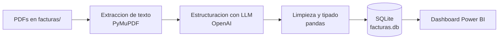

# AI Invoice Processing — Facturas PDF → IA → SQLite → Power BI

Pipeline que **extrae automáticamente los datos de facturas en PDF** usando un modelo de lenguaje (OpenAI), los estructura y consolida en una base **SQLite**, y los expone en un **dashboard de Power BI**. Reemplaza por completo el ingreso manual de facturas.

## Contexto

El registro manual de facturas es lento y propenso a errores. Este proyecto convierte un repositorio de PDFs heterogéneos (distintos proveedores y formatos) en una base de datos consultable y un tablero financiero, sin intervención manual.

## Arquitectura



## Stack

| Categoría | Herramientas |
|---|---|
| Lenguaje | Python |
| Extracción de PDF | PyMuPDF |
| Extracción de datos (IA) | OpenAI (gpt-4o-mini) |
| Datos y persistencia | pandas, SQLAlchemy, SQLite |
| Visualización | Power BI |

## Estructura del proyecto

```
ai-invoice-processing/
├── facturas/                 # (no versionado) PDFs de entrada, organizados en subcarpetas
├── main.py                   # Pipeline: recorre los PDF -> estructura -> guarda en SQLite
├── funciones.py              # Extraccion (PyMuPDF), estructuracion (OpenAI) y paso a DataFrame
├── prompt.py                 # Prompt de extraccion que guia al modelo
├── requirements.txt          # Dependencias (pip)
├── entorno.yml               # Entorno conda (alternativa a requirements.txt)
├── .env.example              # Variables de entorno de ejemplo
├── Plantilla Gastos BI.pbix  # Dashboard de Power BI
└── README.md
```

## Ejecución

1. Clona el repositorio: `git clone https://github.com/Alvaro192023/ai-invoice-processing.git`
2. Instala dependencias con **pip**: `pip install -r requirements.txt`  (o con **conda**: `conda env create -f entorno.yml`)
3. Copia `.env.example` a `.env` y define tu `OPENAI_API_KEY`.
4. Coloca los PDFs en `facturas/` (una subcarpeta por lote).
5. Ejecuta el pipeline: `python main.py` → genera `facturas.db`.
6. Abre `Plantilla Gastos BI.pbix` y conéctalo a `facturas.db` (vía ODBC) para ver el dashboard.

**Campos extraídos por factura:** `fecha_factura`, `proveedor`, `concepto`, `importe`, `moneda`.

## Resultados e impacto

- **Elimina el ingreso manual** de facturas.
- Estructura PDFs heterogéneos de múltiples proveedores en una **tabla consultable**.
- Alimenta un **dashboard financiero interactivo** en Power BI para análisis de gastos.

## Próximos pasos

- Validación y normalización de importes y monedas.
- Deduplicación de facturas ya cargadas.
- Manejo de errores y reintentos por lote, y exposición como API.

## Licencia y contacto

MIT. Álvaro Villanueva Kobayashi — alvarovillakoba515@gmail.com · [GitHub](https://github.com/Alvaro192023)
